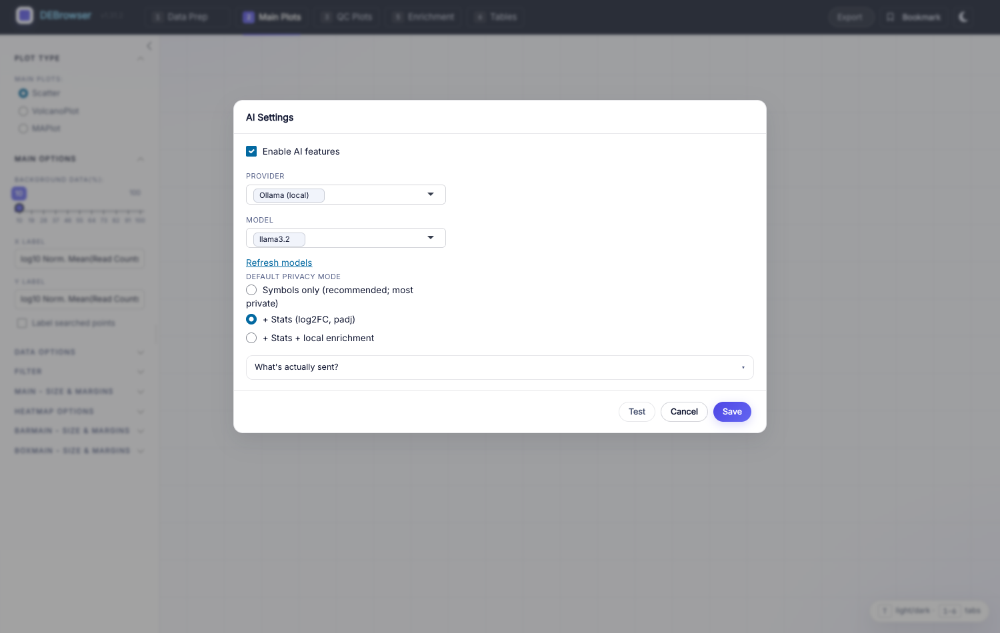

*******************************
Enrichment, Tables & AI
*******************************

Once differential expression has run, the **Enrichment** and **Tables** tabs
turn your gene lists into biology and let you browse and export every result.
DEBrowser also ships an optional **AI interpretation** assistant that summarizes
the biology of a gene set.

GO / KEGG over-representation
=============================

The **Enrichment** tab (top-level tab ``5``) runs over-representation analysis
with `clusterProfiler <https://bioconductor.org/packages/clusterProfiler>`_.
Pick the gene list to analyze — all detected, a Main-Plot / heatmap selection,
or a comparison's up/down set — and choose an ontology on the left:

* **enrichGO** — enriched Gene Ontology terms
* **enrichKEGG** — enriched KEGG pathways
* **Disease** — disease-ontology enrichment
* **compareCluster** — compare enrichment across clustered gene sets

Set your organism, ``padj``, and fold-change cutoffs, then click **Submit**.
Changing the ontology exposes ontology-specific parameters at the bottom of the
option panel. Results render as either a **Summary** plot or a **Dot plot**
(switch with the **Plot Type** selector), and the enriched categories appear on
the **Tables** tab, where **DE Genes** lists the genes behind any category.

.. note::

    Selecting the correct **organism** is required before enrichment will run.
    For the bundled Vernia demo this is mouse (``org.Mm.eg.db``).

GSEA (gene-set enrichment)
==========================

Beyond over-representation, DEBrowser runs rank-based **GSEA** with
`fgsea <https://bioconductor.org/packages/fgsea>`_ against
`MSigDB <https://www.gsea-msigdb.org/gsea/msigdb>`_ collections. Load a gene-set
collection, and DEBrowser ranks your genes and reports enriched pathways with a
**leading-edge** view and a **normalized-enrichment-score (NES) heatmap** across
comparisons — useful for seeing which pathways move consistently across several
contrasts.

Data Tables
===========

The **Tables** tab (top-level tab ``6``) renders results as searchable, sortable
tables. Choose a dataset from the left panel:

* All Detected
* Up Regulated
* Down Regulated
* Up+Down Regulated
* Selected scatterplot points
* Most varied genes
* Comparison differences

Every table (except *Comparisons*) includes: gene **ID**, per-sample normalized
counts, condition averages, **padj**, **log2FoldChange**, **foldChange**, and
**log10padj**. The *Comparisons* table adds, for each pairwise contrast, the
per-sample values plus foldChange, p-value, and padj.

.. tip::

    Every table has a search box (top-right); the left-panel search accepts
    comma-separated lists and regex (e.g. ``^al``, ``*lm``) and applies
    everywhere in DEBrowser — plots and tables alike. If you enter more than
    three lines of genes, the search matches the beginning and end of each
    phrase; otherwise it matches substrings.

    To change parameters or add comparisons, return to **Data Prep** and
    resubmit.

AI interpretation (optional)
============================

DEBrowser includes an optional AI assistant that summarizes the biology of a
gene set alongside a selected GSEA pathway on the Enrichment tab. It is **off by
default** — no network calls happen until you explicitly enable it and configure
a provider.

Enabling AI features
--------------------

1. Open **AI Assistant** (the settings entry in the navbar). A dialog opens.
2. Tick **Enable AI features**.
3. Pick a **Provider**:

   * **Anthropic** (Claude) — API key from console.anthropic.com.
   * **OpenAI** (GPT) — API key from platform.openai.com.
   * **Ollama** (local LLM, no key) — runs entirely on your machine; the
     privacy-preserving option, since no data leaves your computer.

4. Choose a **Model** (auto-populated from your provider; use *Refresh models*
   to re-fetch).
5. For Anthropic / OpenAI, paste your API key — stored encrypted in your OS
   keychain via ``keyring``, never in plaintext on disk.
6. Pick a **default privacy mode** (recommended: *Symbols only*).
7. Click **Test** for a one-token round-trip, then **Save**.

After saving, an AI interpretation card appears below the *Leading edge* card on
the Enrichment tab whenever a GSEA pathway is selected. Pick a question, adjust
privacy and Top-N, preview the exact prompt with **What will be sent?**, then
click **Ask AI**.

Privacy modes
-------------

Three per-call modes control what leaves your machine:

* **Symbols only** (default; most private) — just the leading-edge gene symbols.
* **+ Stats** — also ``log2FoldChange`` and adjusted p-value per gene.
* **+ Stats + Enrichment** — also the term name, fgsea p-value, and overlap
  count.

Responses render as plain preformatted text — no markdown parsing, no HTML
execution, no automatic link traversal — as a defense against untrusted-content
patterns in model output.

Installing the AI packages
--------------------------

The AI features depend on three ``Suggests`` packages::

    install.packages(c("ellmer", "whisker", "keyring"))

If any are missing, AI stays unavailable and DEBrowser shows a clear "Install
the X package…" notice; the rest of the app is unaffected. ``R CMD check`` and
``BiocCheck`` both pass without any AI package installed — the feature is
strictly additive.

Installing Ollama (local provider)
----------------------------------

Ollama runs the model on your own machine — no API key, no data sent out. On
Apple Silicon the standalone install uses the Metal GPU and is far faster than
Docker (which runs Ollama in a Linux VM that cannot reach the Apple GPU)::

    brew install ollama          # or the .dmg from https://ollama.com/download
    ollama serve &               # the menu-bar app also starts this
    ollama pull llama3.2         # ~2 GB, one-time

On Linux::

    curl -fsSL https://ollama.com/install.sh | sh
    ollama pull llama3.2

Verify the API (default ``http://localhost:11434``)::

    curl http://localhost:11434/api/tags

Settings → AI → Provider: Ollama → **Test** runs this check and surfaces a
"Could not reach Ollama" hint if the service is down.

.. note::

    DEBrowser is used in biomedical settings where sharing patient-derived gene
    names with a third-party LLM may be unacceptable. The master switch keeps
    the feature inert until you explicitly opt in, and the local Ollama option
    keeps everything on your machine.
