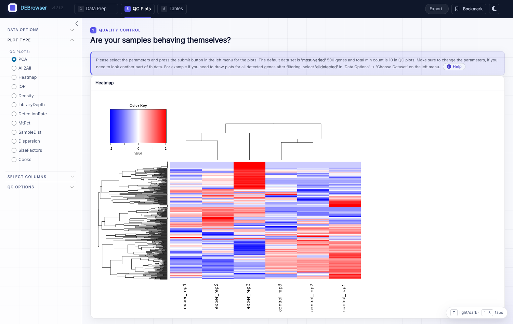

**************
Worked Example
**************

This page walks through a fuller analysis using the **advanced Vernia et al.
(2014)** dataset — quality control before and after batch correction, several
comparisons at once, and a log2-fold-change heatmap for the PPARα pathway.

Quality control before batch correction
=======================================

Load the advanced demo (**Donnard et al.** / **Vernia et al.** under *Demos*, or
your own counts + metadata), then open **Go to QC plots**. Before any
correction, inspect:

* **PCA** — do samples separate by biology or by batch?
* **All2All** — pairwise sample correlations.
* **Heatmap** — clustering of the most-varied genes.

.. image:: ../debrowser_pics2/qc-pca.png
    :align: center
    :width: 99%

.. image:: ../debrowser_pics2/qc-all2all.png
    :align: center
    :width: 99%

Quality control after batch correction
=======================================

Return to **Batch effect**, choose a **Normalization Method** (e.g. MRN) and a
**Correction Method** (e.g. ComBat), and **Submit**. The inline *Before* /
*After* PCA / IQR / Density plots — and the QC tab — should now show samples
clustering by condition rather than by batch.

The Differential Expression plots
=================================

Run DE (**Comparison → Start DE**) and open **Main Plots**. Switch between
Scatter, Volcano, and MA with the **Plot Type** selector; genes are colored Up
(red), Down (blue), and NS (grey) by your cutoffs. Hover a point for its
identity and per-sample bar graphs, and lasso- or box-select a region to spawn a
linked heatmap.

.. image:: ../debrowser_pics2/debrowser-main-plots.png
    :align: center
    :width: 99%

.. image:: ../debrowser_pics2/debrowser-volcano.png
    :align: center
    :width: 99%

Enrichment
==========

Send a gene list (all detected, a selection, or a comparison's up/down set) to
the **Enrichment** tab for GO/KEGG over-representation or GSEA. See the
:doc:`Enrichment page <../enrichment/enrichment>` for the full options.

Log2 fold change comparison for the PPARα pathway
=================================================

This example builds a fold-change heatmap across three comparisons.

1. **Upload.** Load the advanced Vernia dataset and metadata (keep *Separator* =
   *Tab*), then **Upload**.

2. **Filter.** On **Filter & normalize**, choose **Max** with cutoff 10 and
   click **Filter**. For this example, skip batch correction with **Go to DE
   Analysis**.

3. **Comparisons.** On the **Comparison** step, use **Add comparison** to define
   three contrasts (group each by the ``Cond1`` / ``Cond2`` / ``Cond3`` metadata
   columns). Leave the engine parameters at their defaults and **Start DE**:

   * **DE method:** DESeq2
   * **Fit Type:** parametric
   * **betaPrior:** FALSE
   * **Test Type:** Wald

4. **Fold-change table.** Open **Main Plots**, then under **Data Options** →
   **Choose a dataset** select **comparison** (this adds fold-change columns for
   every contrast). Paste the PPARα gene list into the search box::

       Cyp4a12b Cyp4a14 Ehhadh Cyp8b1 Cpt1b Cyp7b1 Slc27a1 Apoa5 Pdpk1 Apoa1
       Acadl Fads2 Fabp4 Acadm Apoa2 Apoc3 Fgf21 Fabp5 Fabp3 Lpl Dbi Nr1h3
       Fabp7 Ppara Ucp1 Sdc1 Sdc3 Sdc2 Fabp2

   To keep every searched gene, disable filtering by setting **padj = 1** and
   **foldChange = 1** in the left-panel **Filter**. Click **Download Data** to
   save the table (count data, padj, and log2 fold change for each comparison).

5. **Prepare the fold-change matrix.** Keep only the fold-change columns and
   rename them, adding a self-comparison column ``chow.wt`` filled with 1:

   * ``foldChange.C1.vs.C2`` → ``chow.dbl``
   * ``foldChange.C3.vs.C4`` → ``hfd.wt``
   * ``foldChange.C5.vs.C6`` → ``hfd.dbl``

6. **Heatmap.** Plot the fold-change matrix with the standalone heatmap. The
   simplest route is::

       library(debrowser)
       startHeatmap()

   Upload your prepared file (*Separator* = *Tab*), tick **Interactive** and
   **Custom Colors**, set min/median/max colors to ``#33FF00`` / ``#000000`` /
   ``#FF0000``, dendrogram **none**, and under **Scale Options** check *Scale*
   and *Log*, uncheck *Center*, and set *Pseudo Count* = 0. See
   :doc:`DEBrowser Modules <../modules/modules>` for driving the heatmap module
   directly from R.

Case study: JNK1 vs JNK2 knockouts
==================================

Using the advanced dataset you can reproduce the paper's findings. Comparing
high-fat-diet JNK1-KO and JNK2-KO against HFD wild type shows a stronger effect
from JNK2 KO: 177 genes at ``padj < 0.01`` and ``|log2FC| > 1`` in the JNK2
comparison, versus only 17 in the JNK1 comparison. In KEGG, the JNK1-KO genes
enrich for "fatty acid elongation" while the JNK2-KO genes enrich for "PPAR
signaling" and "biosynthesis of unsaturated fatty acids" — DEBrowser's comparison
and enrichment tools make this side-by-side analysis straightforward.
