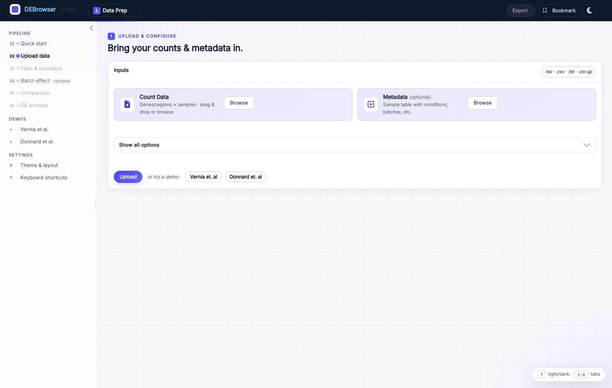

.. DEBrowser documentation master file.

#########################
DEBrowser documentation
#########################

**DEBrowser** turns RNA-Seq differential expression analysis into an
interactive, point-and-click workflow. It wraps three established Bioconductor
engines — `DESeq2 <https://bioconductor.org/packages/DESeq2>`_,
`edgeR <https://bioconductor.org/packages/edgeR>`_, and
`limma <https://bioconductor.org/packages/limma>`_ — in a
`Shiny <https://shiny.posit.co>`_ app, so changing a cutoff, a normalization
method, or a comparison re-draws every plot and table in real time. No code is
required to explore your results, and full reproducibility exports are one click
away when you are done.

|

DEBrowser is organized as a guided **six-step Data Prep wizard** (Quick start →
Upload → Filter & normalize → Batch effect → Comparison → DE analysis) followed
by five result tabs — **Main Plots**, **QC Plots**, **Concordance**,
**Enrichment**, and **Tables**. Along the way it offers batch-effect correction,
interactive scatter/volcano/MA plots with linked heatmaps, GO/KEGG and GSEA
enrichment, cross-contrast concordance, exportable result tables, bookmarking
and reproducibility exports, and an optional AI interpretation assistant.

.. toctree::
   :maxdepth: 2
   :caption: Contents

   local/local
   quickstart/quickstart
   deseq/deseq
   heatmap/heatmap
   enrichment/enrichment
   examples/examples
   modules/modules
   faq/faq
   future/future

Getting started
===============

.. code-block:: r

    if (!requireNamespace("BiocManager", quietly = TRUE))
        install.packages("BiocManager")
    BiocManager::install("debrowser")

    library(debrowser)
    startDEBrowser()

See the :doc:`Installation Guide <local/local>` for source builds and system
dependencies, then the :doc:`Quick-start Guide <quickstart/quickstart>` for a
full walkthrough.

Citation
========

If you use DEBrowser in your research, please cite:

    Kucukural A, Yukselen O, Ozata DM, Moore MJ, Garber M. **DEBrowser:
    interactive differential expression analysis and visualization tool for
    count data.** *BMC Genomics* 2019, 20:6.
    doi: `10.1186/s12864-018-5362-x <https://doi.org/10.1186/s12864-018-5362-x>`_
