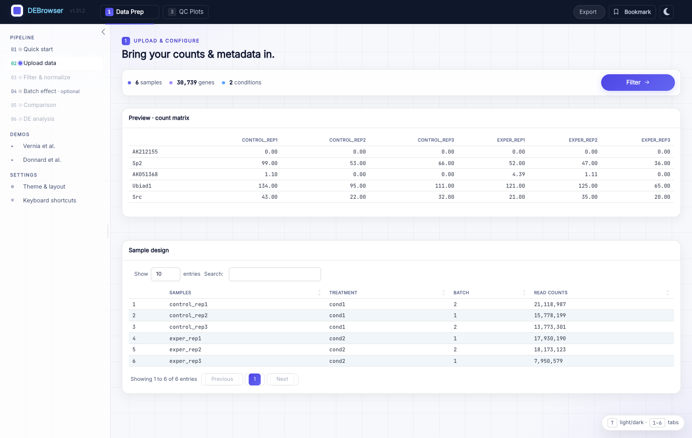
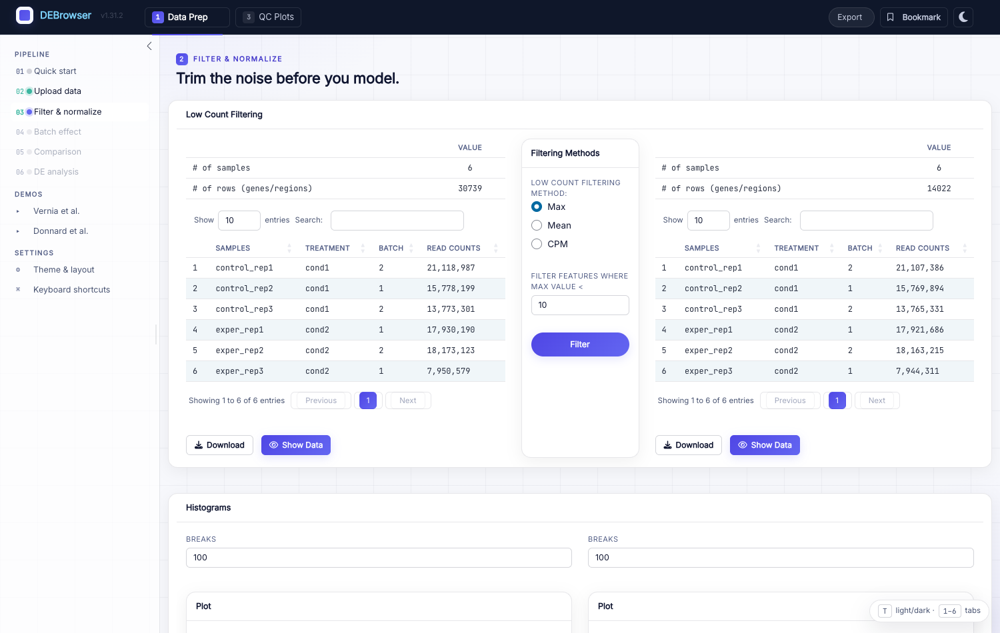
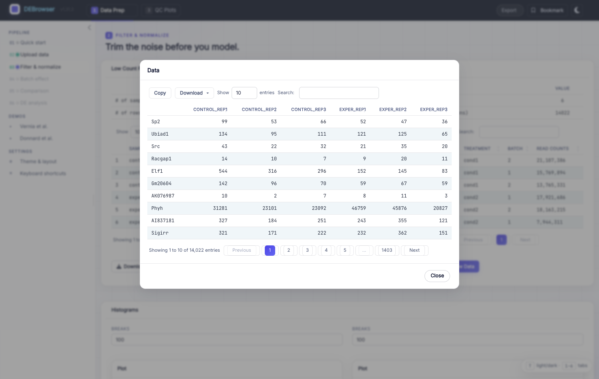
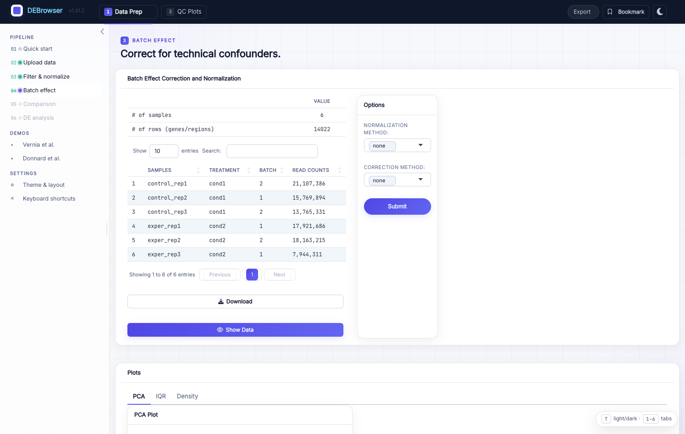
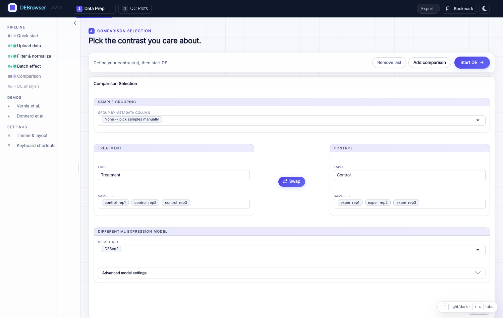
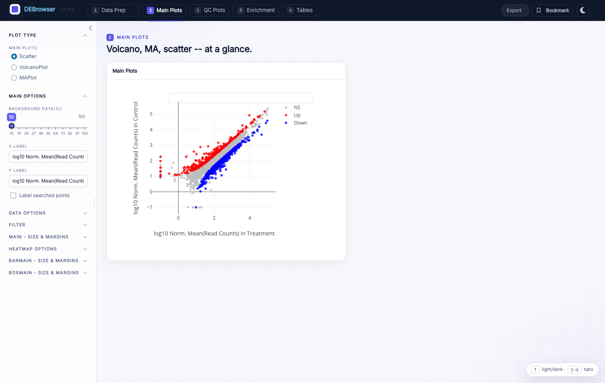
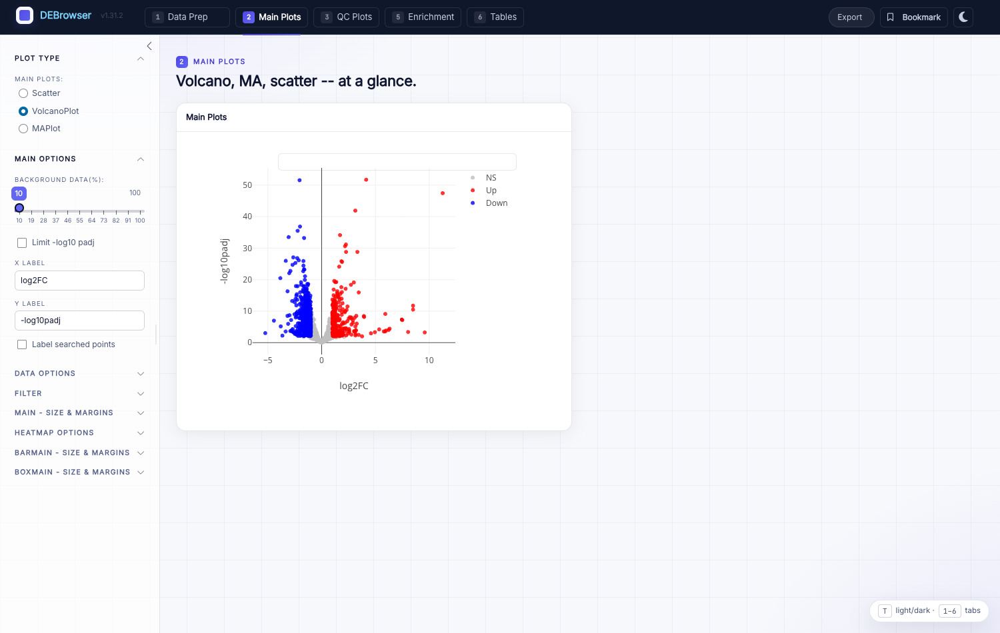
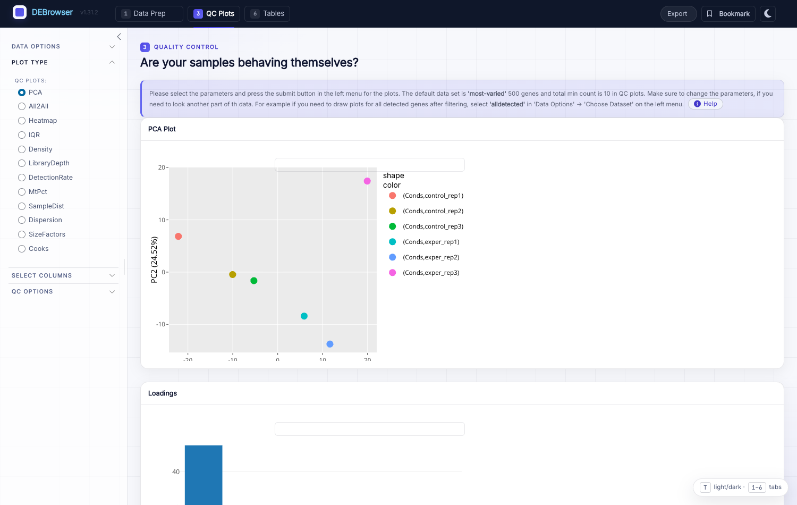
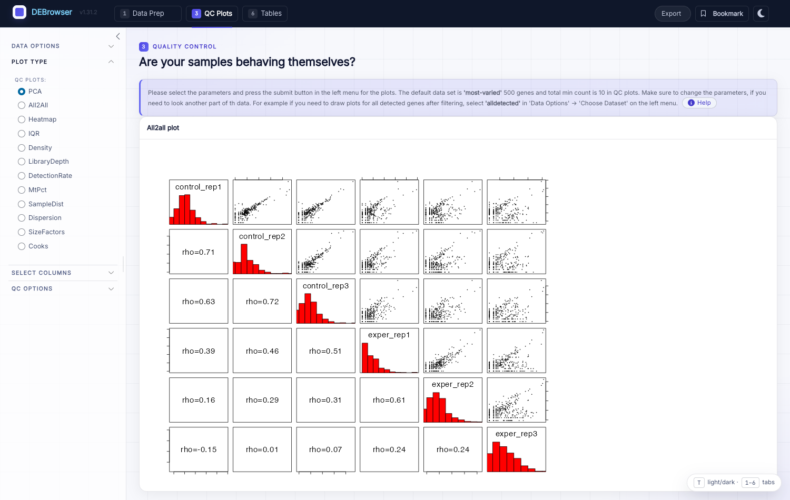
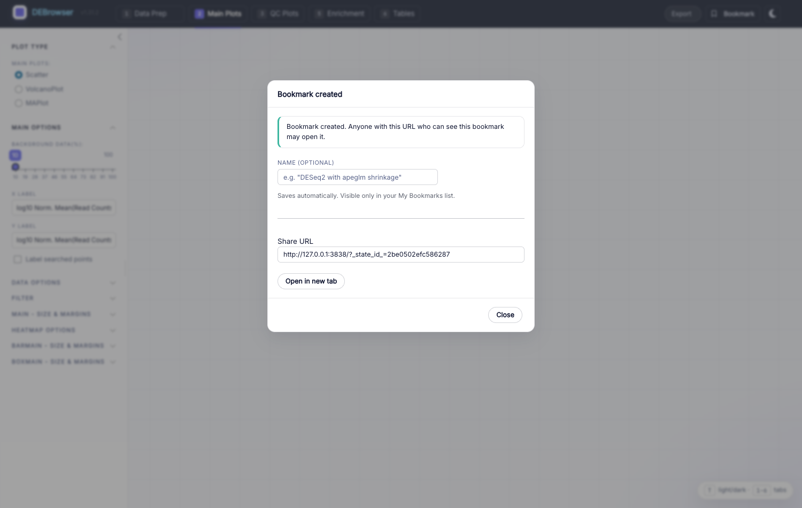

*****************
Quick-start Guide
*****************

This guide walks through DEBrowser from start to finish. The modern interface
is organized as a guided **six-step Data Prep wizard** (Quick start → Upload →
Filter & normalize → Batch effect → Comparison → DE analysis) down the left
rail, followed by five result tabs — **Main Plots**, **QC Plots**,
**Concordance**, **Enrichment**, and **Tables** — that you can jump to with the
number keys ``1``–``6``.

Getting Started
===============

Install the DEBrowser R package from Bioconductor::

    if (!requireNamespace("BiocManager", quietly = TRUE))
        install.packages("BiocManager")
    BiocManager::install("debrowser")

Then load the library and launch the app::

    library(debrowser)
    startDEBrowser()

.. note::

    For source builds and system dependencies, see our
    `Installation Guide <http://debrowser.readthedocs.io/en/latest/local/local.html>`_.
    ``startDEBrowser()`` opens the app in your browser on port ``3838`` by
    default, which keeps bookmark URLs stable across restarts.

DEBrowser opens on the **Upload data** step of the wizard:

.. image:: ../debrowser_pics2/debrowser-upload.png
    :align: center
    :width: 99%

To begin, upload your *count matrix* (comma-, semicolon-, or tab-separated;
``.csv`` / ``.tsv`` / ``.txt`` / ``.csv.gz``). If you do not have data handy,
click **Vernia et al.** or **Donnard et al.** under *Demos* and then **Upload**
to walk the whole pipeline on bundled data.

The count matrix has genes/regions in the first column and one raw-count column
per sample:

=====  =====  =====  =====  =====
gene   exp1   exp2   cont1  cont2
=====  =====  =====  =====  =====
DQ714  0.00   0.00   0.00   0.00
DQ554  0.00   0.00   0.00   0.00
AK028  2.00   1.29   0.00   0.00
=====  =====  =====  =====  =====

.. important::

    DESeq2 requires **un-normalized** counts (it models library size
    internally). Only use pre-normalized values with edgeR or limma.

.. tip::

    DEBrowser can also load data from a URL — see
    `Autoload Data via Hyperlink <quickstart.html#autoload-data-via-hyperlink>`_.

The optional *metadata* table maps each sample to a condition and, if relevant,
a batch. It powers batch correction and makes condition selection easier for
complex designs:

============  =====  =========
sample        batch  condition
============  =====  =========
exper_rep1    1      A
exper_rep2    2      A
exper_rep3    1      A
control_rep1  2      B
control_rep2  1      B
control_rep3  2      B
============  =====  =========

Metadata may use comma, semicolon, or tab separators. You can define as many
condition columns as you need, as long as every sample is present. If your
design is simple, the metadata file is optional.

After **Upload**, DEBrowser shows a summary — sample count, gene count, number
of conditions, a preview of the count matrix, and the sample-design table — so
you can confirm the data was parsed as expected:

From here you can filter low counts and correct batch effects, or skip straight
to differential expression or the QC plots.

Low Count Filtering
===================

The **Filter & normalize** step trims features with little or no signal. Choose
a method from the **Filtering Methods** box:

    * **Max:** filter out genes whose maximum count across all samples is below
      the threshold.
    * **Mean:** filter out genes whose mean count is below the threshold.
    * **CPM:** compute counts per million (raw counts ÷ library size × 1e6),
      then filter genes where fewer than the given number of samples reach the
      CPM threshold.

Enter a threshold and click **Filter**. The row count *before* and *after*
filtering is shown side by side, with per-sample histograms, so you can see the
effect immediately:

.. important::

    Click **Show Data** below the tables to inspect the gene-vs-sample values in
    detail, or **Download** to save the filtered matrix.

Batch Effect Correction and Normalization
=========================================

If you uploaded metadata with a batch column, the **Batch effect** step lets you
correct technical confounders. In the **Options** box:

    * **Normalization Method:** MRN (Median Ratio Normalization), TMM (Trimmed
      Mean of M-values), RLE (Relative Log Expression), upperquartile, or
      *none*. For the demo we use **MRN**.
    * **Correction Method:**
      `ComBat <https://bioconductor.org/packages/sva>`_ (from the SVA package),
      ComBat-Seq, or
      `Harman <https://bioconductor.org/packages/Harman>`_. For the demo we use
      **ComBat**.
    * **Treatment / Batch:** the metadata columns identifying the comparison of
      interest and the batch structure.

Click **Submit**. Inline QC plots — **PCA**, **IQR**, and **Density**, each with
a *Before* / *After* view — appear so you can confirm that samples now cluster by
biology rather than by batch:

.. tip::

    Use **Show Data** to inspect the corrected values, or **Download** to save
    them.

When you are done, continue with **Go to DE Analysis** or **Go to QC plots**.

Comparison Selection & DE Analysis
==================================

The **Comparison** step is where you define which groups to test. DEBrowser
auto-populates a first comparison from your conditions; assign samples to the
**Treatment** and **Control** side (the **Group by metadata column** dropdown
fills them in automatically from a metadata column), then pick the DE engine:

* **Add / remove samples:** click a group's box to add a sample, or select a
  chip and press delete/backspace to remove one. Use **Swap** to flip
  Treatment and Control.
* **Multiple comparisons:** click **Add comparison** to define several
  contrasts at once; each becomes its own DE result set you can switch
  between later.
* **Method:** DESeq2, edgeR, or limma. DESeq2 and edgeR are designed for raw
  counts; limma is best for already-normalized data. Advanced per-engine
  parameters live under **Advanced model settings**.

Click **Start DE**. DEBrowser reports progress in stages
(Normalizing → Fitting → Contrasts) and, when finished, unlocks the result tabs
and opens **Main Plots**. For the parameters of each engine, see
:doc:`Differential Expression <../deseq/deseq>`.

The Main Plots of DE Analysis
=============================

The **Main Plots** tab is DEBrowser's interactive heart. Choose **Scatter**,
**Volcano Plot**, or **MA Plot** from the **Plot Type** section on the left.
Genes are colored **Up** (red), **Down** (blue), or **NS** (grey) according to
your ``padj`` and log2-fold-change cutoffs; adjusting a cutoff re-draws every
plot and table instantly. The plots are interactive — use the plotly toolbar to
zoom, pan, and download.

The Volcano view plots log2 fold change against ``-log10`` adjusted p-value:

.. tip::

    To keep plotting fast, only 10% of non-significant (NS) genes are drawn by
    default. Open **Main Options** on the left and set **Background Data (%)** to
    100% to show them all (recommended for publication figures).

You can hover over any point to see its identity and per-sample / per-condition
bar graphs. The left rail also exposes fold-change and ``padj`` cutoffs, which
comparison to view, and the dataset to analyze. When running multiple
comparisons, the active comparison's samples are shown at the top of the Main
Plots so you always know what you are looking at.

After DE, download results as CSV with **Download Data** under **Data Options**,
and download any plot from its plotly toolbar.

The Heatmap of DE Analysis
==========================

Select a region of a Main Plot with the **box-select** or **lasso-select** tool
and a heatmap of just those genes appears alongside. Click a group label (Up /
Down / NS) in the legend to hide it, so you can lasso only up- or down-regulated
genes; the heatmap updates as you select. The selection also feeds the
Enrichment tab. See :doc:`Heatmaps <../heatmap/heatmap>` for details.

.. tip::

    Normalize before plotting heatmaps: **Data options → Normalization
    Methods**.

Quality Control Plots
=====================

The **QC Plots** tab summarizes the whole dataset independent of any single
comparison. It opens on **PCA**; the **Plot Type** menu on the left switches
between PCA, All2All, Heatmap, IQR, Density, and several sample-level QC views
(library depth, detection rate, mitochondrial %, sample distance, dispersion,
size factors, Cook's distance):

* **PCA** places samples in principal-component space (with a loadings panel)
  so batch or outlier structure jumps out.
* **All2All** shows the pairwise correlation between every sample.
* **Heatmap** clusters the selected dataset; you choose the clustering and
  distance methods (see :doc:`Heatmaps <../heatmap/heatmap>`).
* **IQR** and **Density** compare per-sample distributions before and after
  normalization.

The dataset and normalization used for these plots follow the left-panel
options, and each plot has its own height/width controls and a download button.

.. note::

    The same PCA / IQR / Density views also appear inline on the **Batch
    effect** step, so you can judge correction before running DE.

Concordance
===========

When you define **two or more comparisons**, the **Concordance** tab shows where
the contrasts agree and disagree — for example, which genes move the same way in
two knockouts versus a shared control. This separates condition-specific effects
from shared ones without exporting to another tool, and (if enabled) an AI
assistant can suggest follow-up analyses for the reconciled gene sets.

Enrichment and Data Tables
==========================

The **Enrichment** tab turns a gene list into pathway-level biology with GO/KEGG
over-representation and GSEA; the **Tables** tab renders your results as
searchable, sortable tables. Both are covered in detail on the
:doc:`Enrichment <../enrichment/enrichment>` page.

Bookmarking & sharing
=====================

The **Bookmark** button (top-right) captures the entire analysis state — loaded
data, filters, comparisons, cutoffs, and the active view — behind a stable URL.
Because ``startDEBrowser()`` pins the port, the link keeps working across
restarts, so you can share a specific figure or hand an analysis to a
collaborator exactly as you left it.

Reproducibility & export
========================

The **Export** menu (top-right) turns your interactive session into reusable
artifacts:

    * **R script** — the analysis as runnable R.
    * **R Markdown** — a full report source, plus a rendered **HTML** you can
      open in a new tab.
    * **Jupyter notebook** — the analysis as an ``.ipynb``.
    * **Methods paragraph** — a copy-ready methods description (engines,
      versions, parameters) for a manuscript.

Together with bookmarking, these make a DEBrowser analysis reproducible rather
than a one-off click-through.

Theming & keyboard shortcuts
============================

    * Toggle **light / dark** with the moon/sun button or the ``T`` key.
    * Jump between the six top-level tabs with the number keys ``1``–``6``.
    * Shortcuts are ignored while you are typing in a field.

Autoload Data via Hyperlink
===========================

DEBrowser can load a dataset from a JSON descriptor passed in the URL::

    https://debrowser.umassmed.edu/?jsonobject=<count-json-url>

Add metadata with a second parameter::

    https://debrowser.umassmed.edu/?jsonobject=<count-json-url>&meta=<meta-json-url>

Opening such a URL loads the referenced data automatically.
